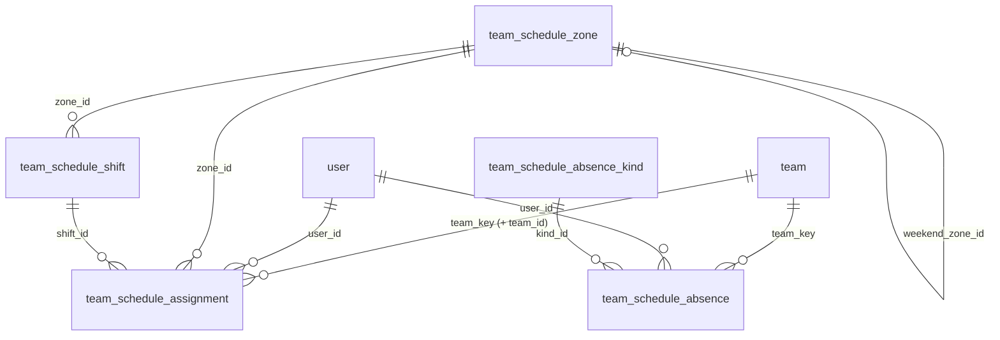

# Team Schedule — data model and deployment

The CRE and SRE rota behind the CSM portal's Team Schedule: who is working,
when, in which escalation tier, and who is away. Portal-native data with no
ServiceNow equivalent, so these tables are the system of record, not a mirror.

**Status:** code merged (#2032). Schema ships as migrations **0152–0156**.
Nothing else needs configuring: the routes are registered whenever
entity-service has a database.

## 1. The model at a glance



Three layers, one prefix. Every table is `team_schedule_*`. That keeps them
apart from `schedule`, `user_schedule` and `schedule_span` (0050), which mirror
ServiceNow's `cmn_schedule` tables and are unrelated to this.

| Layer | Table | One row is | Written by |
|---|---|---|---|
| Catalogue | `team_schedule_zone` | an SRE time zone (TZ1–TZ3) | migration 0154 |
| | `team_schedule_shift` | a named window of the day, e.g. "Evening 6-9pm", "TZ2 escalation" | migration 0154 |
| | `team_schedule_absence_kind` | a kind of time away, e.g. annual leave, Allo-EXT; `family` says which rota offers it | migration 0154 |
| Facts | `team_schedule_assignment` | one engineer, one rota day, one window | leads, via the portal; importers |
| | `team_schedule_absence` | a span of days an engineer is away | leads, via the portal; importers |
| History | `team_schedule_assignment_activity`, `team_schedule_absence_activity` | one change a lead made, as the portal's "Recent changes" shows it | entity-service |
| | `team_schedule_audit` | one row-level change to any state table, from triggers | Postgres |

Plus one column on a shared table: **`team.key`** (0152). This is the only change outside the prefix.

### Time: authored in one clock, read in any

A shift stores `start_minute`/`end_minute`, counted from midnight in its
`authoring_time_zone` (`Asia/Colombo`). An end past 1440 runs into the next
day, so 21:00–06:00 is one row, `1260 → 1800`. An assignment stores the
**resolved instants** `starts_at`/`ends_at`, computed when it is written. So
"who is on duty at 03:14 UTC" is one indexed range query, and it stays
correct across DST.

`rota_date` is the day the **crew** is rostered for. A Monday 21:00–06:00
block is Monday's, even though six of its hours fall on Tuesday.

### The rules the database enforces

| Rule | How |
|---|---|
| Nobody holds two turns at once | `team_schedule_assignment_no_overlap`: GiST exclusion on `(user_id, [starts_at, ends_at))` for turns only (`WHERE is_rotation`, copied from the window by trigger). Half-open, so 18:00 end and 18:00 start is a handover. A zone's regular hours may sit under a turn. |
| Nobody is away twice for two reasons | `team_schedule_absence_no_overlap`: exclusion on `(user_id, [starts_on, ends_on])`, closed at both ends |
| Same person, day and window only once | `team_schedule_assignment_unique_slot (user_id, rota_date, shift_id)` |
| An assignment cannot contradict its window | trigger `team_schedule_assignment_matches_shift`: where the shift fixes a zone or tier, the assignment must match it |
| A window carries at most one midnight | `end_minute <= start_minute + 1440` |
| Only SRE windows have a zone; escalation windows must | two CHECKs on `team_schedule_shift` |
| An assignment's `team_id` and `team_key` agree | composite FK to `team (id, key)` |
| A kind in use cannot be deleted | `kind_id … ON DELETE RESTRICT`. Retire a kind with `is_active = FALSE`. |
| Nobody works two sets of regular hours at once | `team_schedule_assignment_no_overlap_regular`: the same exclusion for regular hours (`WHERE NOT is_rotation`). TZ1's and TZ2's regular hours overlap, and CRE's regular and India-region windows are the same hours, so holding two would put one engineer in two places. A turn over regular hours is still allowed. |
| Deleting a user does not erase their rota | `user_id … ON DELETE RESTRICT` on assignments and absences. Users are deactivated, not deleted; a delete of someone with rota history is refused. |
| A used window's meaning cannot change under its rows | trigger `team_schedule_shift_guard_used`: while any assignment uses a shift, its hours, zone, tier, family and turn/regular flag are frozen (label, short code, colour, sort order, day scope and `is_active` stay editable). A correction is a new shift code, and the old one is retired. A migration that recomputes the rows itself may `SET LOCAL team_schedule.allow_shift_rewrite = 'on'`, as 0154 does. |

## 2. The catalogue (0154)

**SRE day**, as the leads run it:

| Zone | L1, L2 and L3 | Regular hours (SUP) | Weekend crew |
|---|---|---|---|
| TZ1 | 06:00–13:30 | 06:00–15:00 | TZ1+2, 06:00–21:00 |
| TZ2 | 13:30–21:00 | 12:00–21:00 | TZ1+2 |
| TZ3 | 21:00–06:00 | 21:00–06:00 | TZ3, 21:00–06:00 |

At the weekend TZ1 and TZ2 are one crew (`SRE_WE_TZ1`, drawn **TZ1+2**) and TZ3
runs as on a weekday: `SRE_TZ3` is `day_scope = 'ANY'`, and TZ3 is its own
weekend zone. An older database's weekend TZ2 window (`SRE_WE_TZ2`, standing in
for TZ3) is folded into `SRE_TZ3` by 0154, turns included.

**CRE windows:** 6–9am (and its on-call), regular hours LK and IND, 6–9pm,
Americas cover, weekend rotation 06:00–21:00, and Americas weekend (and its
on-call).

Any tier, L1, L2 or L3, can be rostered in any zone. It goes on the zone's
window that fixes that tier where there is one (TZ1's and TZ2's own L1 windows),
otherwise on the zone's escalation window, which leaves the tier to the person.
Regular hours are drawn **SUP** (support in normal hours).

**Kinds of time away**, grouped by bucket:

| Bucket | Kinds |
|---|---|
| `LEAVE` | Annual (AL), Lieu (LL), Maternity (ML), Paternity (PL), Sick (SL) |
| `ALLOCATION` | Allo-INT, Allo-EXT, Brazil rotation (BR) on both rotas; RnD on SRE only; Migration (Mig) on CRE only |
| `EXCLUDED` | Excluded from rota |

`team_schedule_absence_kind.family` is the rota a kind is offered on, and NULL
for both, which is every kind of leave. A lead's picker offers only the kinds
for the rota they are editing.

An allocation is a kind plus **`allocated_to`**, which says who the time is for
(the customer, or the product team for RnD). A new customer is a value, not a new
kind. Retired kinds stay in the table as `is_active = FALSE`: Customer on site,
Customer off site, Customer (unspecified), Onboarding and CRIS. The catalogue
still serves them, marked `retired`, so days already marked with one keep
their label; nothing offers them. On an older database 0154 moves customer
allocations to Allo-EXT, keeping `allocated_to`.

A weekday with nothing marked is a working day. The roster draws it as **LK**
(the CRE regular-hours code) without storing anything, and it gives way as
soon as leave, an allocation or a turn is marked. Weekends stay blank.

Re-running 0154 never overwrites a row a lead has since edited
(`ON CONFLICT DO NOTHING`).

### What a lead can do from the roster

A lead edits their own team's rows in the Month roster's cell picker:

- **Mark leave or an allocation over a span.** They choose a start and end
  date (both editable; the start defaults to the clicked day), then a kind.
  For an allocation there is an optional **For** field, which is stored as
  `allocated_to`. It is never stored with leave. The write is
  `POST /team-schedule/absences/apply`.
- **Roster L1, L2 or L3 in any zone.** For SRE the picker shows an
  escalation grid: every zone worked that day, with L1, L2 and L3 in each,
  not just the zone column that was clicked. The write is
  `POST /team-schedule/assignments/apply` with a `tier`.
- **Turns in more than one zone, and a turn on regular hours.** One engineer
  can be TZ1 L1 in the morning and TZ2 L2 in the afternoon, or on TZ1's
  regular hours (SUP) and TZ1 L1 the same day. Each kind of write replaces
  only its own kind:
  - a new escalation turn displaces only the turns in its own zone or that
    overlap it in time;
  - a zone's regular hours replace only the regular hours held that day;
  - a CRE window, or any window with no zone, still replaces the whole day.

  The roster stacks a turn over whatever it sits on (SUP or an allocation).
  Clearing a turn's cell, when the person holds anything else that day, takes
  off that zone's turn only (`zoneCode` on apply).
- **A tier is required on a zone's shared escalation window** (SRE_TZ1,
  SRE_TZ3, ...). A turn there with no tier is the zone's regular hours, which
  have their own window, and the views read any older tier-less turn that
  way.
- **Two tags in one day.** An allocation (RnD, customer) does not hide a
  rotation turn on the same day. The roster shows both: in the turn's own
  zone column on an SRE day, and stacked in the cell otherwise. Leave still
  takes the whole day, because someone on leave is not on the rota. In a cell
  holding both, **Clear** clears the turn, and the allocation has its own
  **Remove**.
- **Remove a whole span in one click.** Clicking any day of a leave or
  allocation shows the whole span with a **Remove** button, which deletes
  every day of it, including a span with no end date. The write is
  `DELETE /team-schedule/absences/{id}`. Clearing just a few days out of a
  span is still done with the date range and **Clear**.
- **Add a tag.** "+ New tag" adds a leave or allocation kind to the shared
  catalogue: a short code, a name, and a colour from the chip colours the rota
  already draws. The code is derived from the name. A name that is already
  used, or a short code another active kind already uses, is refused. Only
  team leads and rota admins may add a tag, and every team sees it once added. The write is
  `POST /team-schedule/absence-kinds`.
- **Delete a tag a lead added.** A custom tag carries a delete control, and
  deleting takes two clicks because the tag is shared by every team. A
  built-in tag cannot be deleted. A tag still used by any leave or allocation
  is refused, with how many entries use it, rather than retired quietly, which
  would leave those entries with no label or colour. The write is
  `DELETE /team-schedule/absence-kinds/{code}`.

Every write above is gated on the caller leading the team, or being a rota
admin for its group (for a removal, the team recorded on the absence row), and
each is recorded in the absence history and the audit table.

## 3. `team.key` — the one shared-table change (0152)

The rota lists every `team` whose `type` starts with `CRE` or `SRE`. It refers
to each of them by `team.key`, a lower-case handle: `apollo`, `castor`, and so on.

`team` is written by the ServiceNow sync, which knows nothing about `key`. So
0152 adds a **`BEFORE INSERT` trigger that fills `key` from the name** when a
writer leaves it out. Without that trigger the `NOT NULL` would reject every
sync insert that omits the column. That includes an `INSERT … ON CONFLICT DO
UPDATE` of a team that already exists, because Postgres checks the proposed row
before it resolves the conflict (tested). Once a row has a key, the key is never
rewritten, so renaming a team in ServiceNow does not move its rota history.

## 4. Deploying to a server

### Prerequisites

- **PostgreSQL 12 or later** (the schema uses a generated column).
- **`btree_gist` available.** 0153 runs `CREATE EXTENSION IF NOT EXISTS btree_gist`.
  It ships with Postgres, but a managed server may need it allow-listed first
  (Azure Database for PostgreSQL: add it to the `azure.extensions` server
  parameter). The migrating role needs permission to create extensions.
- **Team names unique ignoring case.** If they are not, 0152 stops before
  changing anything and names the clashing teams.
  ```sql
  SELECT lower(name), count(*) FROM team GROUP BY 1 HAVING count(*) > 1;   -- expect no rows
  ```

### Apply

The files are forward-only and safe to re-run. Apply them in order with
`make migrate` from `entity-service/`, which applies and records every file not
yet in `csm_migration_applied_migration`:

```bash
make migrate
```

Each file is its own transaction (`BEGIN` … `COMMIT`, like 0106 and 0114), so a
failure part-way leaves nothing behind, and sets `lock_timeout = '5s'`, so a
table another writer holds makes it fail fast instead of queuing that writer's
next statements behind it. 0152 matters most here: `team` is written by the
ServiceNow sync while it runs. After a lock timeout, re-run the file when the
table is quiet; it is safe to re-run.

Or apply them by hand, one `psql -f` per file (never `psql -1`, since each
file opens its own transaction), and record each one so a later
`make migrate` skips it:

```bash
psql "$DATABASE_URL" -c "CREATE TABLE IF NOT EXISTS csm_migration_applied_migration (filename TEXT PRIMARY KEY, applied_at TIMESTAMPTZ NOT NULL DEFAULT now())"
for f in 0152_team_add_key.sql 0153_team_schedule_tables.sql \
         0154_team_schedule_catalogue.sql 0155_team_schedule_audit.sql \
         0156_team_schedule_rota_admin_roles.sql; do
  psql "$DATABASE_URL" -v ON_ERROR_STOP=1 -f "migrations/$f" &&
  psql "$DATABASE_URL" -c "INSERT INTO csm_migration_applied_migration (filename) VALUES ('$f') ON CONFLICT DO NOTHING"
done
```

| File | Creates / changes | Touches shared tables |
|---|---|---|
| `0152_team_add_key.sql` | `team.key` + fill trigger + two unique constraints | **yes**: `team` |
| `0153_team_schedule_tables.sql` | `btree_gist`, 5 enums, 7 tables, indexes, constraints, the matches-shift and used-shift triggers | reads `team`, `"user"` (FKs only) |
| `0154_team_schedule_catalogue.sql` | 3 zones, 18 windows, 16 kinds | no |
| `0155_team_schedule_audit.sql` | `team_schedule_audit`, its trigger on 5 tables, one BASELINE row per existing row | no |
| `0156_team_schedule_rota_admin_roles.sql` | the `cre_rota_admin` / `sre_rota_admin` roles | **yes**: `role` (seeded by name, `ON CONFLICT (name)`) |

### Rota admins (0156)

A lead edits their own team's rota only. A **rota admin** may edit every team
of one group, so a rota can still be fixed while its lead is away. It is a
role, `cre_rota_admin` or `sre_rota_admin`, one per group; someone who runs
both is granted both. The write check is "a lead of this team, or a rota admin
for its group" (`requireRotaWriter`), and a row still belongs to the team it
is filed under.

**A rota admin is internal staff first.** The role is a schedule permission,
not a way to become internal: `recompute_user_type()` is untouched, so it
still derives `user_type = INTERNAL` from the `admin` and `internal` roles
alone. The schedule refuses any caller who is not INTERNAL, and counts the
rota admin role only on an INTERNAL holder, so granting it to anyone else
(a customer, by mistake) does nothing at all. It never widens what they can
reach elsewhere on the platform.

In the portal a rota admin reads their own group's views as an engineer does,
and the other group's Today only. The page learns the group from the teams
they may edit, since the sign-in token does not carry these roles.

**Granting is a deployment step, not a migration**: who runs each rota differs
per environment. There is no role UI yet, so a grant is a row in `user_role`,
given to someone who already holds `internal` or `admin`:

```sql
INSERT INTO user_role (id, created_on, updated_on, created_by, updated_by, user_id, role_id)
SELECT gen_random_uuid(), now(), now(), 'admin', 'admin', u.id, r.id
  FROM "user" u, role r
 WHERE lower(u.email) = lower('jane.doe@example.com') AND r.name = 'cre_rota_admin';
```

### A server that ran the old file names

Before this schema was renumbered it shipped as `000088`–`000104`, in the old
`.up.sql`/`.down.sql` format. `make migrate` picks up both halves of those
files, and they sort ahead of `0001`. On a server that ran it in that window,
the first two old files applied and the third failed, leaving
`schedule_zone`/`_shift`/`_assignment`/`_absence` under their pre-rename names.
0153 detects that state and drops those four tables, which can only hold
catalogue rows, before building the real ones. If any assignment or absence rows
exist, it refuses and changes nothing. The four old filenames left in
`csm_migration_applied_migration` are harmless.

### Check it worked

```sql
-- 18 windows, 16 kinds (11 active), 3 zones; both rota admin roles present
SELECT (SELECT count(*) FROM team_schedule_shift)                         AS shifts,
       (SELECT count(*) FROM team_schedule_absence_kind WHERE is_active)  AS active_kinds,
       (SELECT count(*) FROM team_schedule_zone)                          AS zones;

-- The teams the rota will show. Empty means nobody will see a rota:
-- the ABT teams need a type beginning CRE or SRE (e.g. CRE-ABT, SRE-ABT).
SELECT key, name, type FROM team
 WHERE lower(type) LIKE ANY (ARRAY['cre%', 'sre%']) ORDER BY type, name;
```

Then open Team Schedule in the portal. The day view renders its bands from
the catalogue whether or not anyone is rostered yet.

### Rollback

There is no down migration. To remove the feature's schema entirely (this
destroys every rota row):

```sql
DROP TABLE IF EXISTS team_schedule_audit, team_schedule_assignment_activity,
  team_schedule_absence_activity, team_schedule_assignment, team_schedule_absence,
  team_schedule_shift, team_schedule_absence_kind, team_schedule_zone CASCADE;
DROP TYPE IF EXISTS team_schedule_shift_family_enum, team_schedule_tier_enum,
  team_schedule_day_scope_enum, team_schedule_source_enum, team_schedule_absence_bucket_enum;
DROP FUNCTION IF EXISTS team_schedule_assignment_matches_shift(), team_schedule_shift_guard_used(),
  team_schedule_audit_row();
-- team.key is shared; leave it unless nothing else has started using it.
```

## Rotas: IaaS SRE and the SME rotations (0199–0200)

A **rota** is a named rotation inside a family. SRE runs SaaS (Apollo & Artemis)
and IaaS. **SME**, a third family added in 0199, runs one rota per product:
Asgardeo, Choreo Runtime, Bijira, Devant, WSO2 Cloud · Agent platform,
WSO2 Cloud · Core and Moesif. The source is the "CSM SRE + SME on call" doc.
PaaS SRE is N/A there, so it has no rota until it has a schedule.

| Rota | Family | Team type | Zones (LK time) | Duty rotates | Escalation |
|---|---|---|---|---|---|
| `SRE_SAAS` | SRE | `sre-abt` | TZ1, TZ2, TZ3 (unchanged) | irregular | 5 min |
| `SRE_IAAS` | SRE | `sre-iaas` | `IAAS_D` 08:00–20:00 · `IAAS_N` 20:00–08:00 | daily | 5 min |
| `SME_ASGARDEO` | SME | `sme-asgardeo` | `ASG_D` 09:30–18:30 · `ASG_N` 18:30–09:30 | daily | 5 min |
| `SME_CHOREO` | SME | `sme-choreo-runtime` | `CRT_D` 06:00–18:00 · `CRT_N` 18:00–06:00 | weekly | — |
| `SME_BIJIRA` | SME | `sme-bijira` | `BIJ_D` / `BIJ_N`, as Choreo Runtime | weekly | — |
| `SME_DEVANT` | SME | `sme-devant` | `DVT_D` / `DVT_N`, as Choreo Runtime | weekly | — |
| `SME_CLOUD_AGENT` | SME | `sme-cloud-agent` | `WCA_D` 06:00–18:00 · `WCA_N` 18:00–06:00 | weekly | 5 min |
| `SME_CLOUD_CORE` | SME | `sme-cloud-core` | `WCC_D` / `WCC_N`, as Agent platform | weekly | 5 min |
| `SME_MOESIF` | SME | `sme-moesif` | `MOE_D` 10:00–22:00 · `MOE_N` 22:00–10:00 | weekly | 30 min |

**How it hangs together:**
- **Teams join a rota by type.** A team is on the rota whose `team_type` matches
  `team.type`, read the same way the family always has been
  (`sme…` → SME, `sre…` → SRE). No column is added to `team`, so the ServiceNow
  sync stays the only writer of team rows: to put a team on a rota, give it the
  rota's type. On a local stack, `scripts/csm-compose/seed-team-schedule-rotas.sql`
  adds one team per new rota.
- **Zones belong to rotas.** `team_schedule_zone.rota_id` (nullable) ties each
  zone to its rota. TZ1–TZ3 are backfilled to `SRE_SAAS`; a zone without a rota
  still works as before.
- **Windows.** Each new zone has one escalation window, worked every day
  (`ANY`), with the tier (L1, L2 or L3) on the assignment, as `SRE_TZ3` does.
  The weekend is the same as the weekdays.
- **Who may edit.** `sme_rota_admin` does for SME what `cre_rota_admin` and
  `sre_rota_admin` do for their families. Granting it stays a deployment step.
- **The catalogue** gains `rotas[]`, `zone.rotaCode` and `team.rotaCode`. All are
  additive; a client that ignores them sees what it saw before. The webapp
  scopes every view to one rota and offers a rota picker only where a family
  has more than one rota with teams, so CRE and SaaS-only SRE read as before.

**IaaS windows start inactive.** The portal before this change reads every
zoned SRE window as part of SaaS's day, week and roster. `0200` therefore
seeds `SRE_IAAS_DAY` and `SRE_IAAS_NIGHT` with `is_active = FALSE`, so an older
webapp still running during the deploy never sees them. Once the rota-aware
webapp is live, switch them on together with giving the IaaS teams their type:

```sql
UPDATE team_schedule_shift SET is_active = TRUE, updated_on = NOW()
 WHERE code IN ('SRE_IAAS_DAY', 'SRE_IAAS_NIGHT');
```

SME's windows ship active: the older portal knows only CRE and SRE and passes
them by.

**Not changed, on purpose:**
- **`rota.escalation_minutes` is informational.** The escalation ladder
  (csm-notification-service) keeps its own timing.
- **The notification service only runs the CRE ladder.** Its rota rungs are
  scoped by team type and key, so the new teams never reach it. An SRE or SME
  ladder is separate work.

## 5. Known gaps

- **Why 0152–0156.** 0141–0150 are claimed by the open RLS work in #2094, and
  upstream's 0151 already sits after that range, so these follow it. The
  numbers have not been checked against `operations/csm-sync-service`, which
  owns `team` and `role`; confirm 0152 and 0156 are free there before
  production.
- **The sync must never need to change `team.key`.** It cannot today, because
  it does not know the column exists. If it ever writes `key`, that value wins
  over the trigger.
- **`team_schedule_audit.changed_at`** breaks the `_on` suffix convention.
  entity-service reads the column by that name, so renaming it is a code
  change as well as a migration.

## Change log

- **0199–0200 rotas.** The SME family; `team_schedule_rota`; `zone.rota_id` (TZ1–TZ3 on `SRE_SAAS`); the zone-family check widened from SRE to SRE or SME; IaaS and seven SME rotas, each with a Day and a Night zone and window; the `sme_rota_admin` role. Nothing is removed, renamed or re-typed, but existing objects do change: 0199 adds a value to `team_schedule_shift_family_enum`; 0200 adds the nullable column `team_schedule_zone.rota_id` and sets it on the existing TZ1–TZ3 rows, and replaces the zone-family CHECK with a wider one (every existing row satisfies it). IaaS's two windows are seeded inactive until the new webapp is deployed.
- **0152–0155** replace `000088`–`000107`, which were written in the old
  up/down format. They reproduce the schema and catalogue that chain ended in
  exactly (compared with `pg_dump` against a server built from the old chain).
  They also add the `team.key` fill trigger. The old files are gone; nothing
  should apply them.
- **Weekend and kinds, same PR.** The SRE weekend is TZ1+2 by day and TZ3 by
  night (was weekend TZ1 and a weekend TZ2 for the night). Absence kinds gained
  `family`; Allo-INT and Allo-EXT are offered again, and the customer
  allocations and Onboarding are retired. 0153 and 0154 bring an older
  database to both, and re-running them changes nothing.
- **Review of #2109.** The rota admin role no longer makes anyone INTERNAL: the
  migration that added it to `recompute_user_type()` is gone, and only an
  INTERNAL holder counts. Each file is one transaction with a 5s lock timeout.
  Rota history survives a user delete (`RESTRICT`), regular hours cannot
  overlap, and a used shift's meaning is frozen. The day view's overnight
  lookup reads only the day before, on the `rota_date` index.
